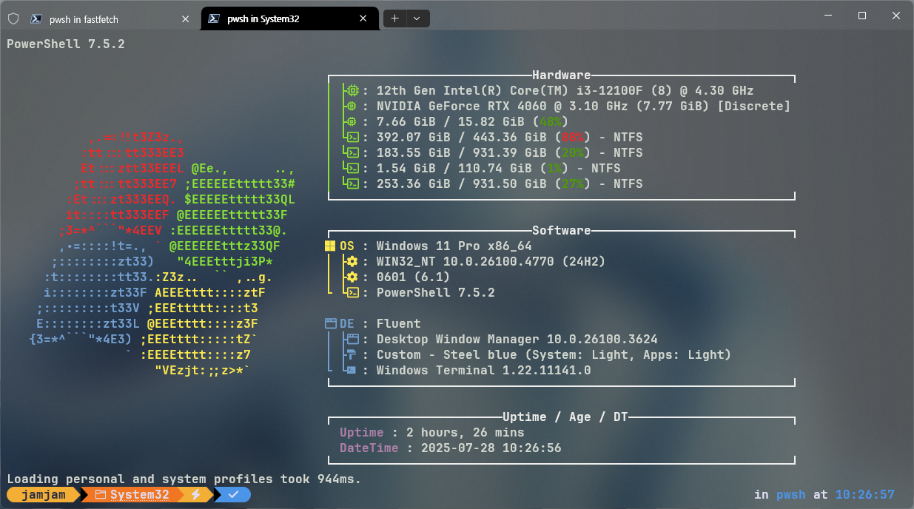

## fastfetch config



개요
---

이 저장소는 저의 Fastfetch 설정을 여러 기기에서 쉽게 동기화하고 변경 사항을 추적하기 위해 만들어졌습니다. 


사용 방법
---

이 저장소의 fastfetch 설정을 시스템에 적용하는 방법은 간단합니다.

[fastfetch configuration](https://github.com/fastfetch-cli/fastfetch/wiki/Configuration)를 참고해서 설정파일을 생성하고 `config.jsonc`파일을 복사 붙여넣기 하세요. 이 방법을 권장합니다.


혹시나 클론(Clone)하고 싶다면

맥OS
```
~/.config/
```
윈도우
```
C:\Users\user\.config
```
로 이동한후

```
git clone https://github.com/cassiofb-dev/fastfetch-config fastfetch
```
명령어를 입력하고 .git , README.md , .png 파일을 삭제하시면 됩니다.
