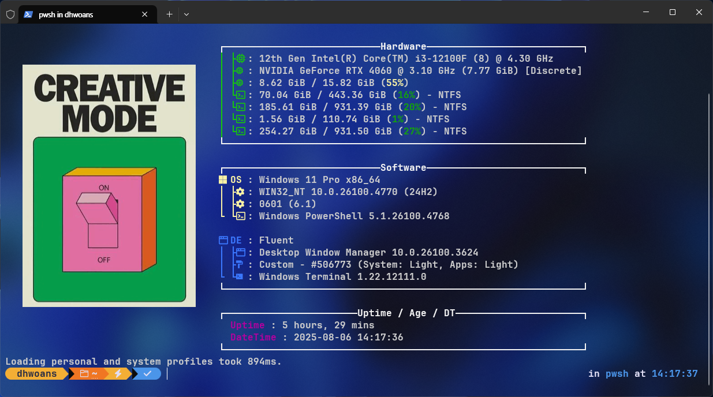

## fastfetch config



개요
---

이 저장소는 저의 Fastfetch 설정을 여러 기기에서 쉽게 동기화하고 변경 사항을 추적하기 위해 만들어졌습니다. 


사용 방법
---
먼저 이글의 모든 작업은 [fastfetch](https://github.com/fastfetch-cli/fastfetch)을 기반으로 했습니다. 자세한 사항을 알고 싶다면 참고하길 바랍니다.

윈도우 환경의 경우 `winget`으로 `fastfetch`를 설치 받을 수 있지만 로고 이미지 출력에 제약사항이 있다고 판단했고 MSYS2를 통해 `fastfetch`를 설치하기로 결정했습니다. MSYS2가 설치되어 있다면
[MSYS2 Packages](https://packages.msys2.org/packages/mingw-w64-ucrt-x86_64-fastfetch)를 통해 `fastfetch`를 내려 받을 수 있습니다.

아래 명령어를 통해 특정경로가 출력되면 이 repo를 그 경로에 클론하면 바로 적용할 수 있습니다.    

```
fastfetch --gen-config
```
MSYS2에 [magick](https://packages.msys2.org/packages/mingw-w64-x86_64-imagemagick)이 설치되어 있다면 sixel 변환 작업없이 로고설정이 가능합니다. 로고의 원본 경로는 절대 경로만 사용할 수 있습니다. 다만 윈도우의 경우 `%ENV_VAR%`이 지원되므로 `fastfetch --gen-config` 에서 출력된 경로를 `%fastfatch%`로 등록했습니다.


Windows Terminal에서[투명한 배경이 안되는 문제](https://github.com/fastfetch-cli/fastfetch/issues/656#issuecomment-1849448969)를 참고해 시도해 보아도 여전히 투명색이 정상적으로 출력되지 않는 문제점이 있습니다.